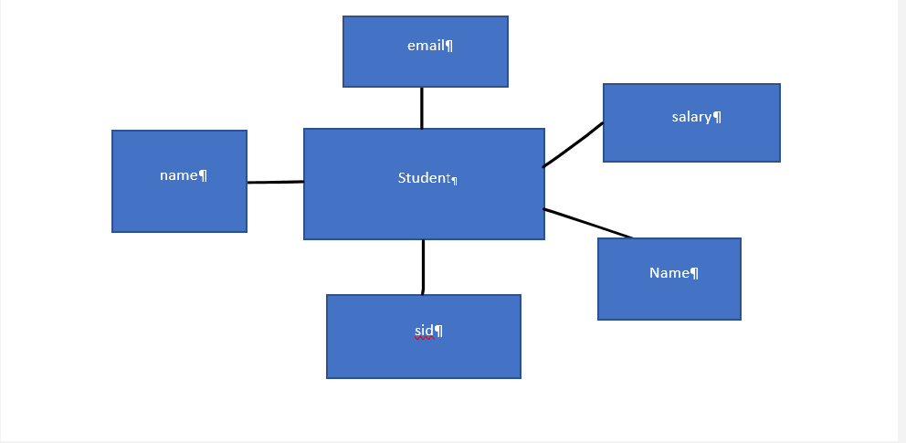
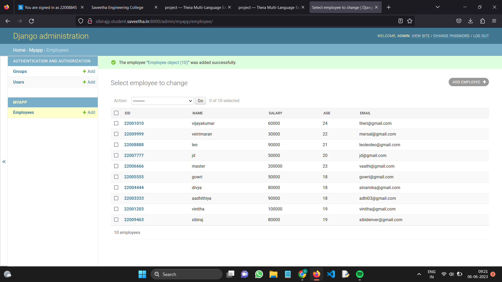

# Ex02 Django ORM Web Application

## AIM
To develop a Django application to store and retrieve data from a student database using Object Relational Mapping(ORM).

## Entity Relationship Diagram



## DESIGN STEPS

### STEP 1:
clone the repository form github.

### STEP 2:
create an admin interference for Django.

### STEP 3:
create app and edit settings.py

### STEP 4:
makemigrations and migrate the changes.

### STEP 5:
create admin user and write python code for admin amnd models.

### STEP 6:
make all the migrations to 'myapp'

### STEP 7:
create an employee database with 10 fields using runserver command. 

## PROGRAM

```
admin.py

from django.contrib import admin
from .models import Employee,EmployeeAdmin
admin.site.register(Employee,EmployeeAdmin)

models.py

from django.db import models
from django.contrib import admin
class Employee (models.Model):
    eid=models.CharField(max_length=20,help_text="Employee ID")
    name=models.CharField(max_length=100)
    salary=models.IntegerField()
    age=models.IntegerField()
    email=models.EmailField()

class EmployeeAdmin(admin.ModelAdmin):
    list_display=('eid','name','salary','age','email')    
```

## OUTPUT




## RESULT
The program for creating an employee database using ORM is executed successfully.
